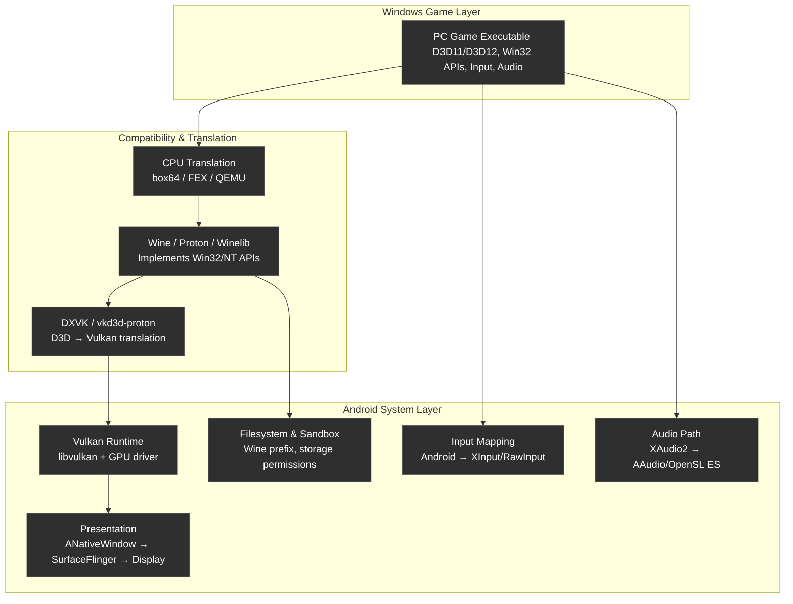

running PC game on android phone via box64, wine, dxvk and etc.

# Install and Config Winlator on Android Phone

1. Downlload and install Winlator variation from: https://github.com/coffincolors/winlator

2. adb push your game bianries to /sdcard/Download/ folder, which is mapped to D: drive in the container.

3. Create an container in Winlator, selecting Vortex as Graphics Driver.

4. Launch the container. Run the test D3D program from start menu -> System Tools -> Test Direct3D.

5. Lanch the game on D: drive and enjoy.


# Install and Config Termux

1. Run `. ./init-venv.py` to setup and activate the virtual python environment.

2. Connect your phone to your dev PC. Verify that it can be found by `adb devices` command

3, Run `./install-termux.py` to install termux and termux-x11 apps. Follow instructions and prompt on phone to continue and finish the installtion.

4. Make sure you phone has internet connection.

5. Launch Termux app. Inside Termud, run the following commands.

    (You may connect to termux via scrcpy.py. This make typing commands in termux much easier)

    ```bash
    pkg update
    pkg install -y openssh
    sshd # launch sshd service
    whoami # this is to show the current user name
    passwd # this is to genereta new pasword for login
    ```

6. Update the user name field in termux-user.txt to match the username return by `whoami` command in the previous step.

7. Forward termux openssh port to local port via adb:

    ```bash
    adb forward tcp:8022 tcp:8022
    ```

    This command forwards the termux 8022 port (which is what the sshd listens to on your phone), to your localhost 8022 port.

8. Copy your ssh public key to termux for easier login:

    ```bash
    ./termux-ssh-login.py --copy-key
    ```

    It'll ask for the password. Use the one you generated in step #3 with `passwd` command.

9. Now you should be able to login to the termux process using termux-ssh-login.py script.

# Install wine:amd64 Inside Termux

1. Install and launch an debian distro in termux

    ```bash
    pkg install -y proot-distro
    proot-distro install debian
    proot-distro login debian
    ```

2. From within the debian distro, Download and extract wine amd64 and its dependencies:

    ```bash
    # register wine:amd64
    dpkg --add-architecture amd64
    dpkg --add-architecture i386
    apt update
    apt install -y wget gpg
    mkdir -pm755 /etc/apt/keyrings
    rm -f /etc/apt/keyrings/winehq-archive.key
    wget -O - https://dl.winehq.org/wine-builds/winehq.key | gpg --dearmor -o /etc/apt/keyrings/winehq-archive.key -
    wget -NP /etc/apt/sources.list.d/ https://dl.winehq.org/wine-builds/debian/dists/trixie/winehq-trixie.sources
    apt update
    # download wine:amd64 to /tmp/windl
    mkdir -p /tmp/winedl && cd /tmp/winedl
    apt-get --download-only install -y --install-recommends winehq-stable:amd64
    cp -v /var/cache/apt/archives/*.deb /tmp/winedl/
    # extact everything to /opt/wine64-root
    mkdir -p /opt/wine64-root
    for f in /tmp/winedl/*_amd64.deb; do
        echo dpkg -x "$f" /opt/wine64-root
        dpkg -x "$f" /opt/wine64-root
    done
    # all done. exit debian distro
    exit
    ```

3. Now, under normal termux prompt (not in debian distro), move the extracted wine:amd64 binaries to your local home folder

    ```bash
    mv /data/data/com.termux/files/usr/var/lib/proot-distro/installed-rootfs/debian/opt/wine64-root ~/wine64-root
    ```

# Install box64 for arm


# Overall simulation flowchart

